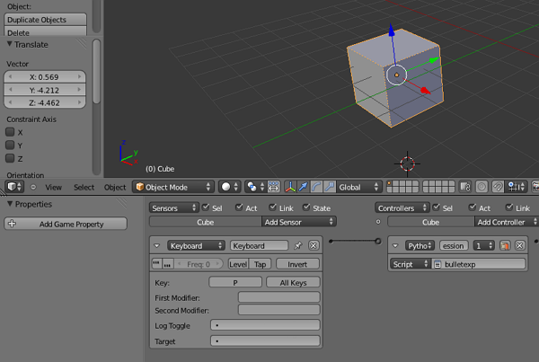
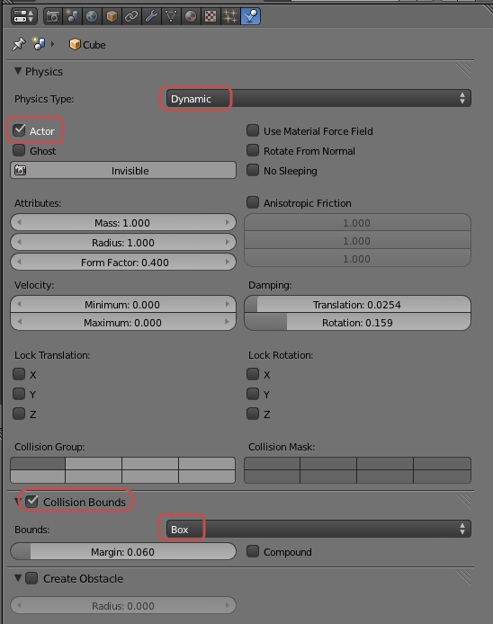
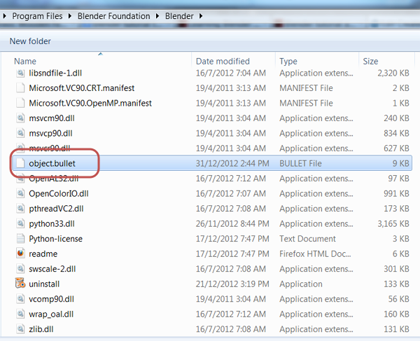

_How to add or create static and dynamic objects with Blender._


## Adding

  - **Create** a model in **Blender**
  - or **Download**, license **must** be: CC0, CC-BY, CC-BY-SA, only, if not specified don't bother  
    _**Note:**_ Do a sane test, to check for proper human **Artist**.  
    There are now many trolls, kids, idiots copying other's or illegally got stuff and putting on Sketchfab, and they don't check it.  
    Usually if you see a name, registered few years ago, with some link to Artist's other website too, then it's good.

### Using objects from other websites
Download from one of the model web portals like [sketchfab](https://sketchfab.com/search?category=nature-plants&features=downloadable&licenses=7c23a1ba438d4306920229c12afcb5f9&licenses=b9ddc40b93e34cdca1fc152f39b9f375&licenses=322a749bcfa841b29dff1e8a1bb74b0b&sort_by=-viewCount&type=models), [blendswap](https://www.blendswap.com/categories), [polyhaven](https://polyhaven.com/models/nature) or [opengameart](https://opengameart.org/)

This here is a short list before contributing.

  - Once seen the model is ok, and can be useful:
    * create a folder with a **good_name** - to have some consistency, when picking model in editor, etc.
    * convert .tga to **.png**, .obj (or other) to .blend
    * use **.jpg** textures to save size (e.g. 90-95% quality), unless transparent / alpha needed
    * check textures, possibly **resize**: for small objects 1k is ok, 2k for bigger,  
      _and 4k is only okay for very big objects, or detailed road, terrrain (future high quality)._
    * add **readme.txt** - a must, with original: model name, Author, License, url
    * (old) possibly attach preview.jpg - so people may be interested in working with the model further
    * make a fork, then PR, to upload to [blendfiles](https://github.com/stuntrally/blendfiles) repo
  - Export from Blender to Ogre .mesh, check the look in game
    * remember to use real life scale (meters)
    * reset all transforms (Ctrl A) before exports
  - **Dynamic** objects need `.bullet` file
    * watch this: [video](http://www.youtube.com/watch?v=fv-Oq5oe8Nw) and add that to logic,  
      then pressing P twice should start physics and export `.bullet` file
    * add simple physics shape(s), make actor (rigid body)
    * on Material tab under Physics set friction
    * on Physics tab set mass, damping (linear and angular, check in game)
    * don't forget to set the Margin to e.g. 0.1 under collision bounds
    * for static models: if too high poly - create 1 simple mesh for collision  
      if low poly - (like 0AD building) do nothing, will have trimesh made in code
  - Done (be happy, suggest adding it to some tracks, or make a new with it, use other too)

----

## Creating

This section walks you through the steps to create new static object and add it to Stunt Rally.

_Warning_: The learning curve for Blender is quite steep, you need to invest a serious amount of time to learn and use it efficiently.  
Fortunately there are plenty of tutorials, videos, websites and books to pick up the skills. 

Currently static and dynamic objects are stored in the `/data/objects` and similar folders.  
It contains Ogre mesh files (binary), surface images (textures) and .bullet files for dynamic objects.


   
#### Tutorial 1

### Requirements

Blender, [Downloads here](https://www.blender.org/download/get-blender/).

### Export plugin

Blender comes with plenty of import and export plugins, but the Ogre export plugin we need to download separately.  
Download the latest **blender2ogre** plugin [from here](https://github.com/OGRECave/blender2ogre/releases)
and follow [installing](https://github.com/OGRECave/blender2ogre#installing) guide.

### Install the plugin in Blender

Open preferences (menu|file), Add-Ons, Install from file, pick io_export_ogreDotScene.py then click Install from file.  
Next switch to tab Import-Export and find OGRE Exporter, mark that checkbox to enable it (if it isn't).


### Install the Ogre Command Line tools

Windows: Download it from http://www.ogre3d.org/download/tools and unzip it to the default folder (C:\OgreCommandLineTools)  
Linux: Should be included with your Ogre package. On Ubuntu, it is included in the ogre-1.9-tools package. The binary we are looking for is "OgreXMLConverter", so try running that to see whether you have it installed.

**NEW**  
For SR3 the `OgreMeshTool` binary is needed, which is built along with Ogre-Next.  
Script [ogre-mesh.py](../config/ogre-mesh.py) can convert multiple Ogre 1.x (or 2.x) `.mesh` files to final 2.1 format.  
Sample syntax for LODs count, distances, tangents and other options passes as arguments to `OgreMeshTool` are in [ogre-mesh.py](../config/ogre-mesh.py).


#### Create a simple static object

For testing purpose we just export a Blender default object (the box, or maybe the monkey)


Export to mesh (File|export|Ogre3D)  
If succesfull, you will find 2 files in the selected folder (1 mesh file in xml format and 1 binary mesh fie)  
From the exporter options pick axes as "xz-y", use tangents (mark checked), uncheck edges-list (we don't need them).

**Copy the binary** `.mesh` into the `objects/` or similar folder.

Start **SR Editor** and place the object.


Works! Now we have the object on our track.  
Not much interaction, other than you can collide with the object, but it will not move.  
That's why we continue to create a dynamic object, by creating a binary `.bullet` file containing all necessary physical information.


#### Create a dynamic object

Blender can export the dynamics of an object (to be more exact of the whole world in your Blender project) to binary file.  
This part of the tutorial will walk through the necessary steps.

Start Blender, we can continue with the previous test object.
Change to the Game Mode


Open the Blender text editor


and enter this code:
```
import PhysicsConstraints;
PhysicsConstraints.exportBulletFile("object.bullet")
```
Save it as `bulletexp`


You cannot execute the script from here, we need to do this via the running game engine.   Open a logic editor window  


Select the cube object in the 3D view. Add a sensor for keyboard input ("p" key) and connect it to a controller to execute our script from above



Open the physics attributes for our object and do the following settings   Physics Type: dynamic   Actor   Collision bounds box



Click into the 3D window and start the engine by pressing "p"   For a short moment you will see the object falling down.   Press "p" again (for our keyboard sensor).

The script creates an `object.bullet` file in the blender folder



Copy the file to the same object folder as our meshfile, it must have the same filename as the mesh file (eg. `object.mesh` and `object.bullet`)

Start the SR editor, place the object. Press "C" to simulate physics, if OK check out your track.

### Remarks on objects
Keep it low poly and use only 1 material if possible.  
I depends on how many times an object will be on track.

Example, triangle counts for various objects:
| triangles | object type |
|-----|------|
| 300 | small rock |
| 600 | fern, plant |
| 1k | small tree, rock, barrel etc |
| 3k | big tree (less on track) |
| 10k | static object, eg. temple, that won't be many times |
| 50k | a detailed object, meant to be once on a track   (eg. inside of pyramid, or spaceship, etc.) |

Using generated LODs (by `OgreMeshTool`) one can then put more (higher quality) objects or vegetation, without final triangles count being too high for game.


## Tutorial 2

### Create new objects

Creating a new object from the scratch with Blender requires at least basic Blender skills.

Stick to **low poly** meshes and don't get tempted to create or download objects with over 50000 triangles, as it can pull down the framerate (Fps).  
Only use hight poly (over 50k tris) meshes if:
- it will be once or twice on track
- it is for main drivable vehicle
- you will reduce (Decimate) it in Blender and it works well
- or you apply good % reducing LODs with OgreMeshTool

### Materials, OLD SR

It is needed to name materials in blender with some prefix (e.g. from your object) so that all material names are unique in game.
Then knowing your material names, it's needed to add them in .mat.
For static objects edit file data/materials/objects_static.mat or objects_dynamic.mat if your object is dynamic (has .bullet file and can move).

The simplest material is white, not that diffuseMap parameter must be present.
```
material my_new_object
{
	parent base
	diffuseMap white.png
}
```

The syntax is quite simple and powerful. It allows using all implemented material features with few lines.
```
material my_new_object
{
	parent base
	diffuseMap pers_struct.dds
	normalMap pers_struct_norm.png
	ambient 0.9 0.9 0.9
	diffuse 1.0 1.0 1.0
	specular 0.4 0.4 0.3 6
	terrain_light_map true
	bump_scale 1.3
}
```
Your texture file name should be after diffuseMap. This file should also be copied to data/objects (same place where .mesh and .bullet).

Use ambient, diffuse and specular for colors of different lighting, all have Red,Green,Blue values. Ambient is constant (this is what you see when objects is in shadow). Diffuse depends on light direction (only the lit side). And specular also has a power exponent, the 4th value, after R,G,B. Small values e.g. 4 make matte-like surfaces, where high e.g. 64 make it quite shiny.

Comments are made with `//`. So if you don't want to use a line you can either delete it or add `//` in front.

If you have a normalMap use it in material (remember to have tangents generated during export). Normal map could be either already provided, or you can generate it using GIMP normal map plugin.
The last parameter bump_scale can be used to scale normal map's effect. Default value is 1.0. More will make it bumpier.

You can use own texture for specular in specMap.   
It's either RGBA and alpha is the exponent. But that is tedious to edit everytime.   
To use only RGB add line specMap_rgb true, then specMap can also be jpg and exponent is in alpha of specular color like usual.
